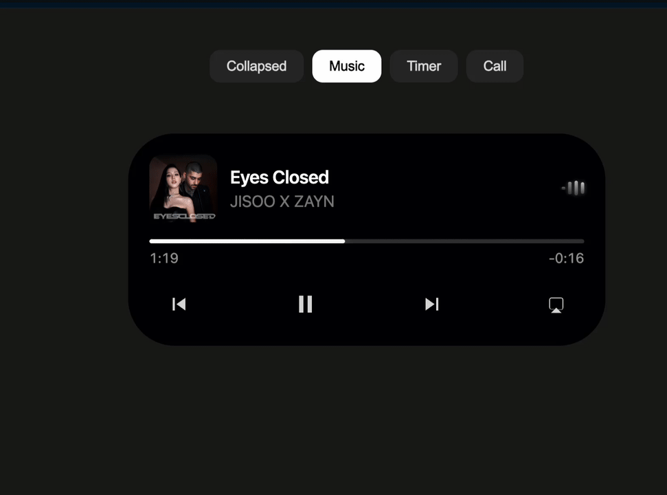

# Angular Motion Example

Dynamic Island demo built with Angular and [motion.dev](https://motion.dev) animations.



## Tech Stack

- Angular 20.3.6
- Motion.dev
- TypeScript

## Development

```bash
npm install
ng serve
```

Open `http://localhost:4200/`

## Build

```bash
ng build
```
